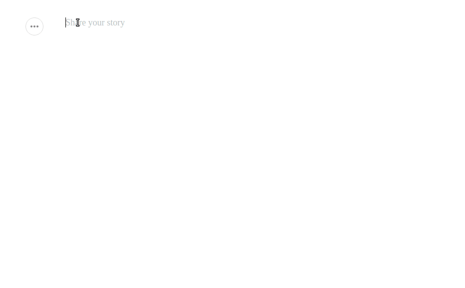

# draft-js-iframely-plugin
Embed links with iframe.ly into your draft-js editor.

*This is a plugin for `draft-js-plugins-editor`.*



## Installation
```
npm install draft-js-iframely-plugin
```

## Usage
This plugin embeds URLs in different ways:
1. When press Enter in a block that the text is a URL.
2. When paste a text that is a URL (disabled by default).
3. Intregrating the Embed button with `draft-js-side-toolbar-plugin`.

```js
import createIframelyPlugin from 'draft-js-iframely-plugin';
const iframelyPlugin = createIframelyPlugin({
  options: {
    apiKey: 'my-api-key'
  }
});
const { EmbedButton } = iframelyPlugin;
```

#### Embedder
When integrate the plugin with `draft-js-side-toolbar-plugin` and click the Embed button, it will display a plceholder where you can paste the URL.
Pressing Enter will close and embed the URL; but, losing the focus, pressing ESC or DEL with empty text will close the Embedder.

## Configuration
| Param        | Default                             | Description                                                       |
|--------------|-------------------------------------|-------------------------------------------------------------------|
| embedderType | 'draft-js-iframely-plugin-embedder' | Type of entity created when inserting the embedder block.         |
| embedType    | 'draft-js-iframely-plugin-embed'    | Type of entity created when embedding the URL.                    |
| decorator    | -                                   | Empty decorator that returns the same component. (No decorations) |
| theme        | Default styles                      | draft-js-iframely-plugin/lib/plugin.css                           |
| options      | Default behavior                    | List of options.                                                  |

#### Options
| Option         | Default                                                                                      | Description                                                                                                                       |
|----------------|----------------------------------------------------------------------------------------------|-----------------------------------------------------------------------------------------------------------------------------------|
| apiKey         | (Required)                                                                                   | Iframely API Key.                                                                                                                 |
| placehoder     | 'Paste a link to embed content and press Enter'                                              | Text as placeholder for the Embedder.                                                                                             |
| handleOnReturn | true                                                                                         | Embed the text when press Enter if it is a URL.                                                                                   |
| handleOnPaste  | false                                                                                        | Embed the text pasted if it is a URL.                                                                                             |
| params         | ``` {   iframe: 1   rel: 'summary',   omit_script: true,   align: 'center',   html5: 1 } ``` | Params to pass in the request.   https://iframely.com/docs/parameters                                                             |
| onRequest      | `return (await fetch(url)).json()`                                                           | Function to request the metadata of the URL. It will receive the URL to request and MUST return a JSON, contaning the key 'html'. |

## Theming
The plugin ships with a default styling available at this location in the installed package: `node_modules/draft-js-image-plugin/lib/plugin.css`

*Webpack Usage*
1.  Install Webpack loaders: `npm i style-loader css-loader --save-dev`
2.  Add the below section to Webpack config (if your config already has a loaders array, simply add the below loader object to your existing list.

```js
module.exports = {
  module: {
    loaders: [
      {
        test: /plugin\.css$/,
        loaders: [
          'style-loader', 'css',
        ]
      }
    ]
  }
};
``` 
3.  Add the below import line to your component to tell Webpack to inject the style to your component.

```js
import 'draft-js-iframely-plugin/lib/plugin.css';
```

## Example
```js
import React from 'react';
import ReactDOM from 'react-dom';

import Editor from 'draft-js-plugins-editor';
import { EditorState } from 'draft-js';
import createSideToolbarPlugin from 'draft-js-side-toolbar-plugin';
import BlockTypeSelect from 'draft-js-side-toolbar-plugin/lib/components/BlockTypeSelect';

import createIframelyPlugin from 'draft-js-iframely-plugin';
import 'draft-js-side-toolbar-plugin/lib/plugin.css';
import 'draft-js-iframely-plugin/lib/plugin.css';

const iframelyPlugin = createIframelyPlugin({
  options: {
    apiKey: '<my-api-key>',
    handleOnReturn: true,
    handleOnPaste: true
  }
});
const DefaultBlockTypeSelect = ({ getEditorState, setEditorState, theme }) => (
  <BlockTypeSelect
    getEditorState={getEditorState}
    setEditorState={setEditorState}
    theme={theme}
    structure={[
      iframelyPlugin.EmbedButton
    ]}
  />
);
const sideToolbarPlugin = createSideToolbarPlugin({
  structure: [DefaultBlockTypeSelect],
});
const { SideToolbar } = sideToolbarPlugin;

class MyEditor extends React.Component {
  constructor(props) {
    super(props);
    this.state = {
      editorState: EditorState.createEmpty()
    };
    this.plugins = [
      sideToolbarPlugin,
      iframelyPlugin
    ];
  }
  
  onChange = (editorState) => {
    this.setState({ editorState });
  }

  render() {
    return (
      <div className="editor">
        <Editor
            editorState={this.state.editorState}
            onChange={this.onChange}
            plugins={this.plugins}
            placeholder="Tell a story" />
        <SideToolbar />
      </div>
    );
  }
}

ReactDOM.render(<MyEditor />, document.getElementById('root'));
```

## Integration
#### With other plugins
In this example you can see how integrate the plugin with `draft-js-focus-plugin` and `draft-js-alignment-plugin`. 

```js
import Editor, { composeDecorators } from 'draft-js-plugins-editor';
import { EditorState } from 'draft-js';

import createFocusPlugin from 'draft-js-focus-plugin';
import createAlignmentPlugin from 'draft-js-alignment-plugin';
import createIframelyPlugin from 'draft-js-iframely-plugin';

import 'draft-js-focus-plugin/lib/plugin.css';
import 'draft-js-alignment-plugin/lib/plugin.css';
import 'draft-js-iframely-plugin/lib/plugin.css';

const focusPlugin = createFocusPlugin();
const alignmentPlugin = createAlignmentPlugin();
const { AlignmentTool } = alignmentPlugin;

const decorator = composeDecorators(
  alignmentPlugin.decorator,
  focusPlugin.decorator
);
const iframelyPlugin = createIframelyPlugin({
  decorator, // Here! - the plugin accepts a decorator.
  options: {
    apiKey: '<my-api-ky>',
    handleOnReturn: true,
    handleOnPaste: true
  }
});

class MyEditor extends React.Component {
  constructor(props) {
    super(props);
    this.state = {
      editorState: EditorState.createEmpty()
    };
    this.plugins = [
      focusPlugin,
      alignmentPlugin,
      iframelyPlugin
    ];
  }
  
  onChange = (editorState) => {
    this.setState({ editorState });
  }
  
  render() {
    return (
      <div className="editor">
        <Editor
            editorState={this.state.editorState}
            onChange={this.onChange}
            plugins={this.plugins}
            placeholder="Tell a story" />
        <AlignmentTool />
      </div>
    );
  }
}

ReactDOM.render(<MyEditor />, document.getElementById('root'));

```
#### Axios
See how to provide your own implementation to fetch the URL.
`onRequest` Must return a `Promise` that resolves to a JSON with the metadata.

```js
// npm install axios --save
import axios from 'axios';

const iframelyPlugin = createIframelyPlugin({
  options: {
    apiKey: '<my-pi-key>',
    onRequest: (url) => {
      return axios.get(url).then(res => res.data);
    }
  }
});
```
